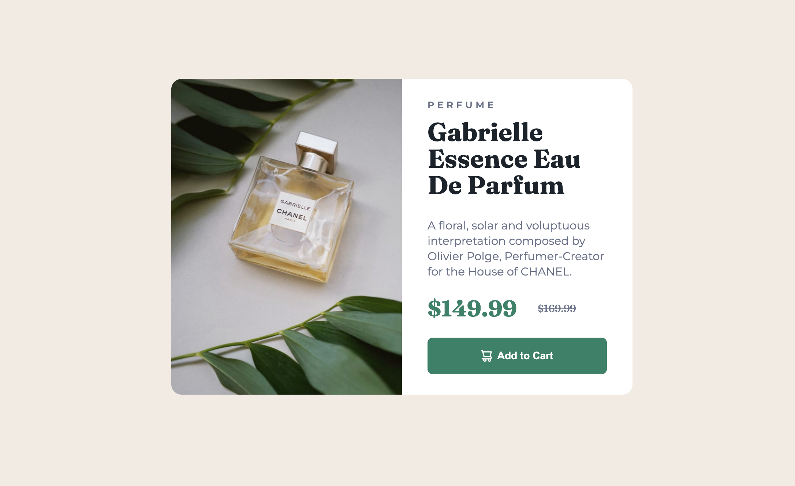
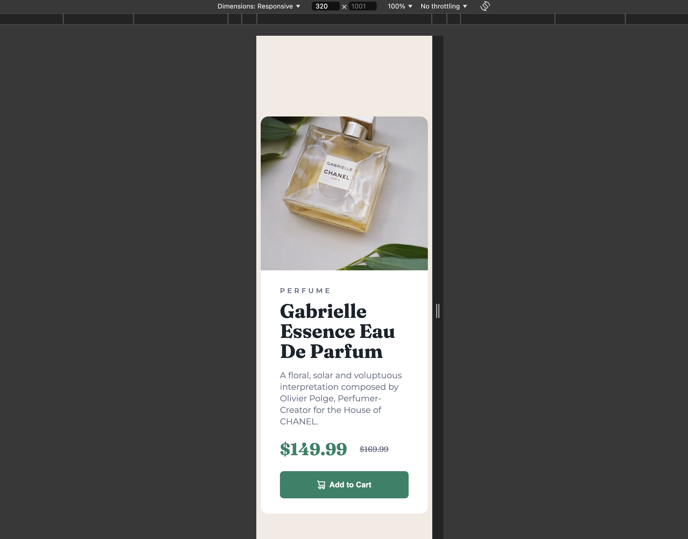

# Frontend Mentor - Product preview card component solution

This is a solution to the [Product preview card component challenge on Frontend Mentor](https://www.frontendmentor.io/challenges/product-preview-card-component-GO7UmttRfa). Frontend Mentor challenges help you improve your coding skills by building realistic projects. 

## Table of contents

- [Overview](#overview)
  - [The challenge](#the-challenge)
  - [Screenshot](#screenshot)
  - [Links](#links)
- [My process](#my-process)
  - [Built with](#built-with)
  - [What I learned](#what-i-learned)
- [Author](#author)
- [Acknowledgments](#acknowledgments)

**Note: Delete this note and update the table of contents based on what sections you keep.**

## Overview

### The challenge

Users should be able to:

- View the optimal layout depending on their device's screen size
- See hover and focus states for interactive elements

### Screenshot




### Links

- Solution URL: [Solution URL](https://lordag.github.io/fm-05-product-preview-card-component/)

## My process

### Built with

- Semantic HTML5 markup
- CSS custom properties
- Flexbox
- Mobile-first workflow

### What I learned

I used the Mobile-first workflow for the first time starting to work on the mobile layout, I found it very good.

For the images at the beginning I used an element to which I associated an image depending on whether I was on mobile or desktop.
Then I found a way that uses the picture tag to manage the images depending on the size of the device you are using.
It is very convenient and allows you to write more semantic code.

```html
<div class="image__container">
  <picture>
    <source media="(max-width: 36em)" srcset="./images/image-product-mobile.jpg">
    <source media="(min-width: 36em)" srcset="./images/image-product-desktop.jpg">
    
  </picture>
</div>
```
```css
/* Mobile < 36em */
.image__container img{
    width: 100%;
    border-top-left-radius: 1rem;
    border-top-right-radius: 1rem;
} 

/*Other > 36em*/
    .image__container{
        width: 50%;
        height: auto;
        border-top-left-radius: 1rem;
        border-bottom-left-radius: 1rem;
        border-top-right-radius: 0rem;
        overflow: hidden;
    }
    
    .image__container img{
        border-top-right-radius: 0rem;
        width: 100%;
        height: 100%;
        object-fit: cover;
        object-position: center;
    }
```

## Author

- Frontend Mentor - [@lordag](https://www.frontendmentor.io/profile/lordag)

## Acknowledgments

I wanted to thank  [@Rahexx](https://www.frontendmentor.io/profile/Rahexx) for the advice he gave me, it was very helpful.